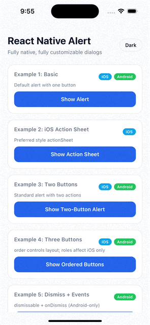
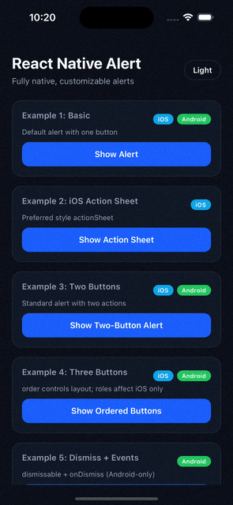
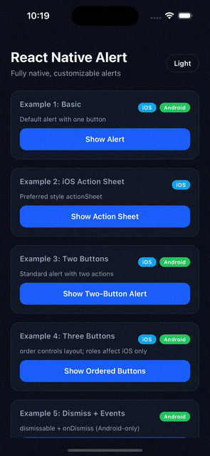

# react-native-alert

<table>
  <tr>
    <td></td>
    <td></td>
  </tr>
  <tr>
    <td></td>
    <td></td>
  </tr>
</table>

Fully native alert dialogs for iOS and Android with a simple imperative API and Android custom styling (rounded buttons, custom colors, loading, ripples). iOS stays on public `UIAlertController` APIs.

## Installation

```sh
npm install react-native-alert
```

iOS:

```sh
cd ios && pod install
```

Expo:
- Works with `expo run:ios` / `expo run:android`
- Not supported in Expo Go

## Usage

```js
import { Alert } from "react-native-alert";

Alert.show({
  title: "Hello",
  message: "This is the default alert.",
  buttons: [{ text: "OK" }],
});
```

## Support

[Buy me a coffee](https://buymeacoffee.com/yabouhalawa)

## API

### Alert.show(options, onEvent?)

Shows a native alert. Returns a handle with `dismiss()`.

```js
const handle = Alert.show(
  { title: "Syncing", loading: true, buttons: [{ text: "Cancel" }] },
  (event) => {
    if (event.type === "action") {
      console.log(event.payload?.id);
    }
  }
);

// Later
handle?.dismiss();
```

### Alert.dismiss()

Dismisses the current alert if one is shown.

## Options

### Common

- `title?: string`
- `message?: string`
- `dismissable?: boolean` (default: `true`)  
  Android only; iOS does not dismiss by tapping outside.
- `buttons?: AlertButton[]`
- `onDismiss?: () => void` (JS side callback)

### iOS-only

- `iosPreferredStyle?: "alert" | "actionSheet"`  
  Uses `UIAlertControllerStyleAlert` or `UIAlertControllerStyleActionSheet`.

### Android-only (custom styling + layout)

- `backgroundColor?: ColorValue`
- `borderColor?: ColorValue`
- `borderWidth?: number`
- `cornerRadius?: number`
- `titleColor?: ColorValue`
- `messageColor?: ColorValue`
- `loading?: boolean`
- `loadingColor?: ColorValue`
- `loadingSize?: number`

## Buttons

```ts
type AlertButton = {
  id?: string;
  text?: string;
  role?: "default" | "cancel" | "destructive"; // iOS only
  order?: number; // controls ordering/layout on both platforms
  dismissOnPress?: boolean;
  onPress?: () => void; // JS-only
  textColor?: ColorValue; // Android only
  rippleColor?: ColorValue; // Android only
};
```

### Button ordering

- Sorting is by `order` ascending (then original index).
- Android max buttons: **3**. Extra buttons are ignored.
- Android layout:
  - 1 button: right
  - 2 buttons: both on the right
  - 3 buttons: **one on the left**, **two on the right**  
    The **lowest order** button is rightmost (primary).

## Examples

### Two buttons with ordering

```js
Alert.show({
  title: "Enable notifications?",
  message: "You can change this later in Settings.",
  buttons: [
    { text: "Not now", order: 1 },
    { text: "Allow", order: 0 },
  ],
});
```

### iOS action sheet

```js
Alert.show({
  title: "Options",
  message: "Choose an action",
  iosPreferredStyle: "actionSheet",
  buttons: [
    { text: "Share", role: "default", order: 0 },
    { text: "Delete", role: "destructive", order: 1 },
    { text: "Cancel", role: "cancel", order: 2 },
  ],
});
```

### Android custom styles + loading

```js
Alert.show({
  title: "Signing in",
  message: "Checking your credentials...",
  loading: true,
  loadingColor: "#60a5fa",
  backgroundColor: "#0f172a",
  borderColor: "#1e293b",
  borderWidth: 1,
  cornerRadius: 22,
  titleColor: "#f8fafc",
  messageColor: "#cbd5f5",
  buttons: [
    { text: "Cancel", textColor: "#94a3b8", rippleColor: "#334155", order: 1 },
    { text: "Retry", textColor: "#60a5fa", rippleColor: "#1d4ed8", order: 0 },
  ],
});
```

### iOS

<table>
  <tr>
    <td></td>
    <td></td>
  </tr>
  <tr>
    <td></td>
    <td></td>
  </tr>
</table>

### Android

<table>
  <tr>
    <td></td>
    <td></td>
  </tr>
  <tr>
    <td></td>
  </tr>
  <tr>
    <td></td>
    <td></td>
  </tr>
</table>

## Contributing

- [Development workflow](CONTRIBUTING.md#development-workflow)
- [Sending a pull request](CONTRIBUTING.md#sending-a-pull-request)
- [Code of conduct](CODE_OF_CONDUCT.md)

## License

MIT

---

Made with [create-react-native-library](https://github.com/callstack/react-native-builder-bob)
